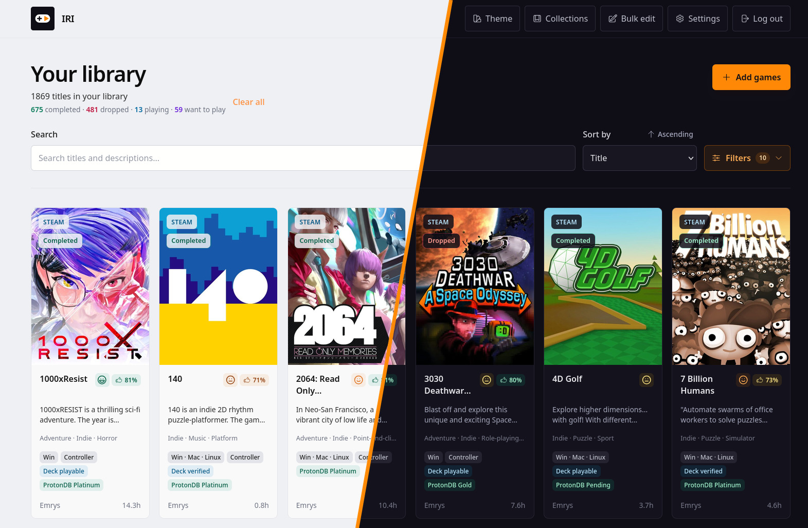
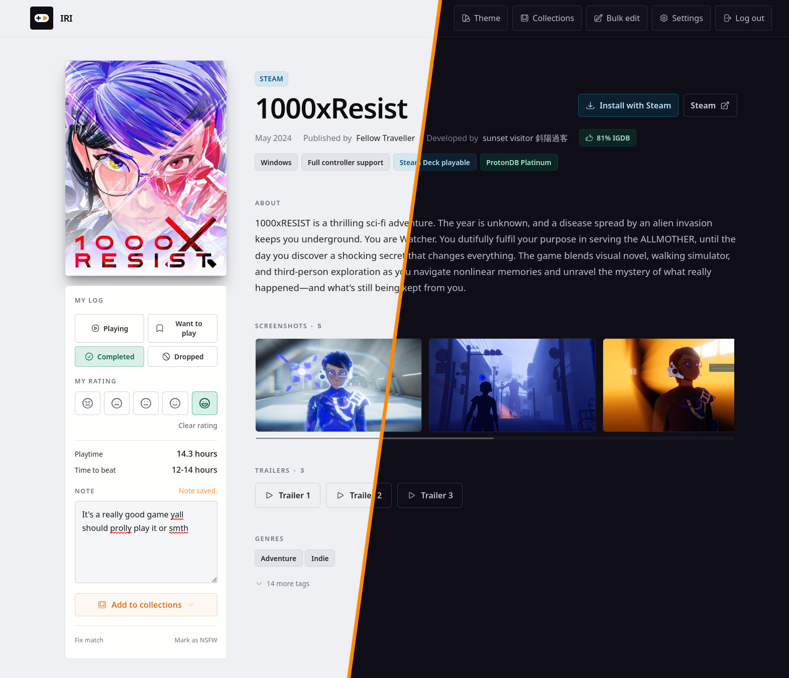
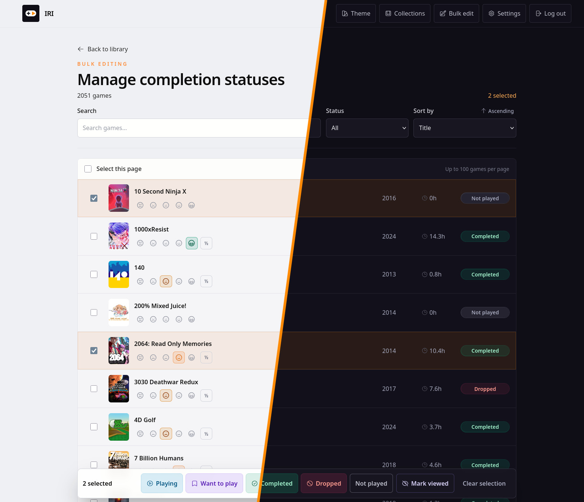
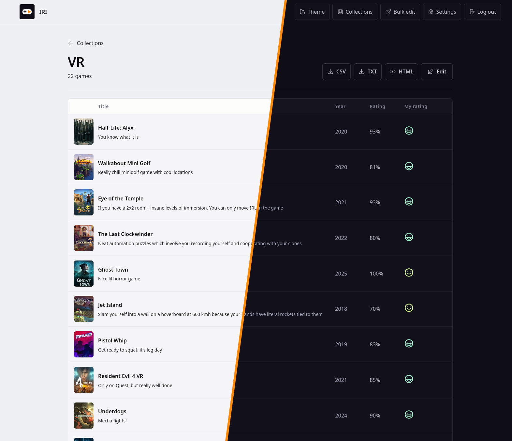

# IRI



(More [screenshots](#screenshots) below)

## What is this?

IRI is a self-hosted backlog management game library exploring thingy. The features - in no particular order and with zero attempt to align verbs on the list - are:

* Automatically (or semi-automatically) import your games from Steam, GOG, Epic Games, PlayStation and Xbox;
* Manually add games (provided they can be found in IGDB or VNDB);
* Family sharing mode (so that other users in your family can browse your enormous library);
* Keeps track of your playtime (only for Steam and GOG);
* Record which games you've dropped and which you've beaten, along with your rating and notes.
* Search by tags, genres, and hardware capabilities (i.e. "does it run well on Steam Deck");
* Convenient (well, convenient to me) bulk edit mode;
* Exportable game collections, so that you can easily share all your favorite rogue-like deckbuilders;
* Somewhat browsable with gamepad with a "Install with Steam" button (because library browsing experience on the Steam Deck is miserable);
* Very browsable on mobile;
* Optional ✨AYYY-EYYYE✨ integration to automatically match games to their IGDB entries (for uncertain cases like region-specific copies, special editions, etc).

There's a read-only demo available [here](https://iri-demo.fly.dev) if you want to play around with it.

You can also see an example of an exported static collection [here](https://graynk.space/iri/cool-vr-games/).

If you're curious about the codebase, take a look in [ARCHITECTURE.md](ARCHITECTURE.md).

This repo is also mirrored to a [Forgejo instance](https://git.pub.solar/graynk/iri).

## Questions that nobody asked but you might want to have an answer to

### Why not Backloggd or Infinite Backlog?

I've tried them and wasn't happy with neither import nor bulk edit capability. With IRI I actually managed to finally import my 2k+ library and categorize and rate all of them.

I assume there are other self-hosted solutions that are trying to do the same thing, but I haven't found something that would fully fit my needs.

### Why is it called IRI?

Wouldn't you like to know.

### Why is there no auto-importer for Nintendo games?

Because there's nowhere to get the data from.

### Why is there a giant initial commit, where's the development history?

You _don't_ want to see this development history. I'm more or less happy with the current state though, so this is what I'm sharing. There are other reasons too, but my employer might be reading, so shush.

### Can't you host it for me?

No. It does support "public" mode in case someone wants it, but given that literally only Steam provides proper public API (and even that doesn't cover everything) - it's going to be a royal PITA to host publicly reliably.

### I connected Steam/GOG/etc but where are the cover images?

The initial sync can take quite a few minutes (especially image downloading and ProtonDB data sync), you can keep track of the progress in **Settings → Sync runs**

### Is it AI slop that will be dead in a month?

The code is mostly AI generated over the course of (roughly) a month. It's also just a library management tool, so it's not gonna steal your car or kill your dog.

I've built it for me and my gf to use, it's been working well for me and I intend to keep using it (whether it gets any new features - remains to be seen). If you find it useful too - great. Can it be made in a better way? Of course! Do I have time for that? No, have you seen the size of my backlog?

### You're stupid and your code is stupid and it's all done stupidly

Not really a question, but open an [issue](https://github.com/graynk/iri/issues) or submit a PR to make it better.

## How to run it?

### Run with Docker Compose

(Examples are written for Docker, but it also works with Podman)

1. The app heavily relies on IGDB, so you'll need a token. Create an application in the [Twitch Developer Console](https://dev.twitch.tv/console/apps), then copy its Client ID and Client Secret.

2. Prepare the Compose file:

   ```sh
   cp docker-compose.example.yml docker-compose.yml
   openssl rand -base64 48
   ```

   ```dotenv
   SECRET_KEY_BASE=paste-the-openssl-output-here-or-just-put-a-long-random-secret-here-ok
   IGDB_CLIENT_ID=paste-your-twitch-client-id-here
   IGDB_CLIENT_SECRET=paste-your-twitch-client-secret-here
   ```

3. Start IRI:

   ```sh
   docker compose up -d
   ```

4. Open `http://SERVER_IP:4000` in a browser.

This is the most basic default setup. Look at the [Configuration](#configuration) and [Provider setup](#provider-setup) to set up Steam/Xbox/AI integrations and tweak other knobs.

IRI uses SQLite for the database. Keep Docker's data directory on a reliable local filesystem. Do not place the
database volume on NFS, SMB, a cloud-synchronised folder, or unreliable USB
storage; SQLite relies on correct filesystem locking and durable writes.

### Run without Docker

Every release also ships `iri-<tag>-linux-x86_64.tar.gz`, a self-contained Mix
release that bundles the Erlang runtime. You do not need Elixir or Erlang
installed, but you do need a glibc Linux on x86_64 (it will not run on Alpine or
on ARM) and SQLite's shared library.

1. Download the tarball and its checksum from the release page, verify it, and
   unpack it:

   ```sh
   sha256sum --check iri-<tag>-linux-x86_64.tar.gz.sha256
   mkdir -p /opt/iri && tar -xzf iri-<tag>-linux-x86_64.tar.gz -C /opt/iri
   ```

2. Set the same environment variables the Compose file uses. `DATABASE_PATH` is
   required, and the media directory defaults to `media/` beside the database:

   ```sh
   export DATABASE_PATH=/var/lib/iri/iri.db
   export SECRET_KEY_BASE=$(openssl rand -base64 48)
   export IGDB_CLIENT_ID=... IGDB_CLIENT_SECRET=...
   ```

3. Start it:

   ```sh
   /opt/iri/bin/server
   ```

Migrations run automatically at boot, exactly as they do in the container. Run
it under systemd (or your init of choice) to get restarts and logging; the
release also responds to `/opt/iri/bin/iri stop` and `remote` for a shell.

## Development

IRI requires Elixir 1.20 or newer and SQLite. Run `mix setup` to fetch
dependencies, create the development database, and build assets, then start the
application with `mix phx.server`. Provider credentials are optional in
development. Run `mix precommit` before submitting a change.

## Configuration

| Variable | Required | Meaning |
| --- | --- | --- |
| `LIBRARY_MODE` | No | `FAMILY` (default) shares libraries between users by default and lets administrators create accounts. `PUBLIC` enables public sign-up and makes new libraries private by default. Explicit per-library sharing overrides either default. |
| `PHX_HOST` | No | Hostname used to generate absolute share and Steam OpenID callback URLs. Not needed for direct-IP access. |
| `PHX_SCHEME` | No | External URL scheme, `http` (default) or `https`. This does not change the container's internal HTTP listener. |
| `PHX_URL_PORT` | No | External URL port; defaults to `4000` for HTTP and `443` for HTTPS. |
| `DATABASE_PATH` | No | SQLite path. The Compose file sets it to `/data/iri.db`. |
| `MEDIA_ROOT` | No | Cached-media directory; defaults beside the database. |
| `TZ` | No | IANA timezone used for maintenance schedules and displayed timestamps, for example `Europe/Berlin`. Defaults to `Etc/UTC`. |
| `DOWNLOAD_SCREENSHOTS` | No | Set to `true` to cache IGDB-provided screenshots during metadata refreshes. Defaults to `false`; uncached and failed downloads continue to use the direct IGDB URLs. |
| `SECRET_KEY_BASE` | Production | Phoenix's browser-session and signed-link secret. Replacing it signs users out and invalidates collection share links. The signing salts committed in the source are public domain-separation values, not replacement secrets. |
| `STEAM_WEB_API_KEY` | No | Enables Steam imports. Shared, server-only Steam Web API key. |
| `IGDB_CLIENT_ID`, `IGDB_CLIENT_SECRET` | Production | Required IGDB metadata credentials. The short-lived IGDB token is held in memory only. |
| `OPENXBL_API_KEY` | No | Enables Xbox gamertag lookup and played-history imports. The Xbox control stays disabled without it. |
| `PORT` | No | Container HTTP port; default `4000`. |
| `NSFW_MEDIA` | No | Server default for sensitive media: `BLUR` (default), `ALLOW`, or `HIDE`. Users can override it in Account settings or keep using the server default. |
| `AI_MATCHING_PROVIDER` | No | `disabled` (default), `openai`, `anthropic`, or `openai_compatible`. The compatible option works with hosted gateways and self-hosted servers exposing an OpenAI-style API. |
| `AI_MATCHING_API_KEY` | AI matching | Provider token. Required for native OpenAI/Anthropic; optional for `openai_compatible`, since local endpoints commonly run without authentication. |
| `AI_MATCHING_MODEL` | AI matching | Exact API model ID exposed by the selected provider or local server. IRI does not guess one. |
| `AI_MATCHING_BASE_URL` | Compatible AI endpoint | Base URL such as `http://ollama:11434/v1`. HTTP is accepted for private, self-hosted networks. It may also override a native provider URL for a compatible proxy. |
| `AI_MATCHING_API_STYLE` | Compatible AI endpoint | Selects `chat_completions` (default) or `responses`; Applicable only for `openai_compatible`. |
| `AI_MATCHING_OUTPUT_FORMAT` | Compatible AI endpoint | Structured-output dialect: `json_schema` (default), `json_object`, `llama_json_schema`, or `vllm_structured`. Applicable only for `openai_compatible`. |
| `AI_MATCHING_MODE` | No | `auto` (default) immediately applies validated matches and clear non-game rejections; `review` puts every recommendation in the administrator queue without applying it. |

## Provider setup

### Steam

1. Create a key at [Steam Web API Key](https://steamcommunity.com/dev/apikey).

2. Add it to the Compose `.env` file:

   ```dotenv
   STEAM_WEB_API_KEY=paste-your-steam-key-here
   ```

Each user may then connect a public Steam profile from **Settings → Integrations**, either by entering its ID/URL or choosing the account through Steam OpenID. Steam **Profile** and **Game details** visibility must be public. Ownership and that Steam user's playtime are imported.

### IGDB

Create an application in the [Twitch Developer Console](https://dev.twitch.tv/console/apps). Set its Client ID and Client Secret as `IGDB_CLIENT_ID` and `IGDB_CLIENT_SECRET`; production IRI will not start without them. IGDB supplies canonical descriptions, artwork, screenshots, trailers, ratings, taxonomy, and the search used by **Library → Add games**.

### VNDB

No key is required. When IGDB cannot resolve a Steam or GOG game, IRI checks the public [VNDB Kana API](https://api.vndb.org/kana) for an exact Steam AppID or GOG product slug attached to a visual-novel release. Exact matches supply VNDB descriptions, developers, ratings, tags, covers, and screenshots. Title-only VNDB guesses are not applied automatically.

### GOG

No key or GOG login is needed. Enter a public GOG username or `gog.com/u/...` profile URL. IRI reads the public games/stats pages, including public playtime, and stores no GOG cookie, password, access token, or refresh token.

### Epic Games

For this one I wanted to avoid parsing the HTML page, so I rely on the 3rd party tool - Legendary.

1. Install [Legendary](https://github.com/legendary-gl/legendary).

2. Log in to your EGS account:

   ```sh
   legendary auth
   ```

3. Export your library:

   ```sh
   legendary list --json > epic-games.json
   ```

4. Upload `epic-games.json` under **Settings → Integrations → Epic Games**.

### PlayStation

This one is even worse then EGS. Open **Settings → Integrations → PlayStation** and follow the steps shown there. You will have to copy a Javascript helper, log in to the [PlayStation Games Library](https://library.playstation.com/recently-purchased) and run the helper in the developer console. It will then give you a JSON file to import into IRI.

### Xbox

Here IRI relies on a 3rd party API provider.

1. Create an API key in the [OpenXBL dashboard](https://xbl.io/).

2. Add it to the Compose `.env` file:

   ```dotenv
   OPENXBL_API_KEY=paste-your-openxbl-key-here
   ```

Each IRI user then connects a gamertag; include its `#suffix` when present so IRI can resolve the right XUID.

### Optional AI-assisted matching

The normal IGDB/VNDB matching flow always runs first. If ambiguous titles remain,
`auto` mode queues and processes them immediately after deterministic metadata
enrichment. In `review` mode, an
administrator explicitly starts the current unresolved queue from
**Settings → Matches**. After an application restart, manually queued review-mode
work stays paused until **Run AI on unresolved** is pressed again.

IRI stops issuing AI requests after 500 provider calls in one day to contain
accidental costs; queued work becomes eligible again the following day. This is
an internal safety limit, not an operator setting.

When the initial candidates are empty or do not contain a defensible match, the
model may propose up to two corrected catalog searches, for example by removing
a regional suffix and then broadening an over-specific title. IRI performs each
search and asks the model to decide again from the verified results.

For OpenAI, create a key in the [OpenAI API key
page](https://platform.openai.com/api-keys), e.g.:

```dotenv
AI_MATCHING_PROVIDER=openai
AI_MATCHING_API_KEY=replace-with-your-openai-key
AI_MATCHING_MODEL=gpt-5.6-luna
AI_MATCHING_MODE=review
```

The native OpenAI adapter always uses the Responses API, so do not set
`AI_MATCHING_API_STYLE` for this configuration. IRI does not currently override
the model's reasoning effort. For GPT-5.6, that means OpenAI's current default
of `medium`.

`review` retains the model's recommendation for an administrator and applies
nothing automatically. `auto` applies validated catalog matches and clear
non-game rejections.

For Anthropic, create a key in the [Anthropic
Console](https://console.anthropic.com/settings/keys), e.g.:

```dotenv
AI_MATCHING_PROVIDER=anthropic
AI_MATCHING_API_KEY=replace-with-your-anthropic-key
AI_MATCHING_MODEL=replace-with-an-available-model-id
AI_MATCHING_MODE=auto
```

Any service exposing a sufficiently compatible OpenAI API can use the generic
adapter. This includes local model servers and hosted routing services. The
token is optional:

```dotenv
AI_MATCHING_PROVIDER=openai_compatible
AI_MATCHING_BASE_URL=http://ollama:11434/v1
AI_MATCHING_MODEL=qwen3:8b
AI_MATCHING_API_STYLE=chat_completions
AI_MATCHING_OUTPUT_FORMAT=json_schema
AI_MATCHING_MODE=auto
```

Useful compatibility settings are:

| Server capability | `AI_MATCHING_OUTPUT_FORMAT` |
| --- | --- |
| OpenAI-compatible JSON Schema response format, including current Ollama | `json_schema` |
| JSON mode without schema enforcement | `json_object` |
| llama.cpp's simplified JSON Schema response format | `llama_json_schema` |
| vLLM's native `structured_outputs` request field | `vllm_structured` |

For Docker deployments, the base URL must be reachable from inside the IRI
container. `localhost` means the IRI container itself; use the other
container's Compose service name, or a host address reachable from Docker. If a
server implements the OpenAI Responses API instead, set
`AI_MATCHING_API_STYLE=responses`.

## Accounts, libraries, and sharing

The first registered account is the administrator. In `FAMILY` mode, further accounts are created under **Settings → Accounts**; Steam sign-in works for an already linked/created user but cannot create an unknown account. In `PUBLIC` mode anyone may register and Steam may create a new IRI account.

Every provider account has an owner. `FAMILY` makes `inherit` libraries visible to all signed-in users; `PUBLIC` makes `inherit` private. The owner can instead choose everyone or selected users. Playtime and personal game state remain scoped to the signed-in user.

Collections are private unless sharing is enabled. A generated collection URL is a read-only link and works without an IRI account. Anyone with the link can view it until sharing is disabled; links are marked `noindex` and should still be treated as secrets.

## Scheduled jobs and retries

Production schedules nightly Steam/GOG/Xbox ownership and new metadata work followed by an SQLite integrity check, a weekly full metadata/compatibility refresh, and monthly media cleanup. Scheduled tasks, sync progress, retry times, and leases are stored in SQLite. If a worker or VM dies, an expired lease becomes claimable on a later scheduler tick. Retryable failures back off up to six hours rather than looping in memory. Manual Epic and PlayStation imports are never fetched on a schedule.

## Screenshots







## License

Copyright (C) 2026 Nikita Karpukhin.

IRI is free software licensed under the [GNU Affero General Public License,
version 3 or later](LICENSE). Third-party materials remain subject to the
licenses listed in [THIRD_PARTY_NOTICES.md](THIRD_PARTY_NOTICES.md).
